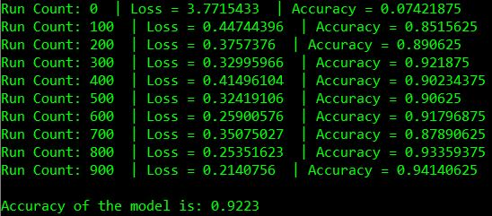

# Machine Learning Digit Recognition Model
This neural network recognizes handwritten digits (0-9) with an accuracy rate of 92.32%. Using Tensorflow and the MNIST dataset, an object recognition model is built and trained to verify and predict the correct number for the written digit displayed.

## Implementation
### Data Source
- The MNIST Database of Handwritten Digits (http://yann.lecun.com/exdb/mnist/)

### Technologies Implemented
- Python (ver. 3.7.4)
- Tensorflow (ver. 1.4.0)
- numpy (ver. 1.18.1)
- Pillow (ver. 7.0.0)

## Future Improvements
- Increased Accuracy (using comples network architectures, up to 99% can be reached)
- Expansion of input (multiple digits)
- Implementation of convolution layers for all handwritten text
